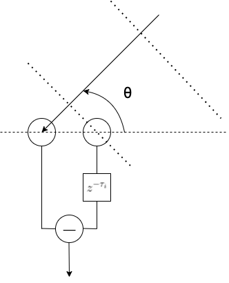

## Key Ideas
1. Using a "Spatial Derivative" of the Scalar Acoustic Pressure Field as a Beamformer
2. Done by using the finite-difference between each array
3. Creates a Frequency-Invariant Beampattern
4. Also known as a superdirectional array
5. Prone to noise

### Ideal Case
A propogating acoustic plane-wave can be modeled as:
$p(\vec{k}, \vec{r}, t) = P_{0}e^{j(\omega t - \vec{k}^{T}\vec{r})} = P_{0}e^{j(\omega t - \lVert \vec{k}\rVert \lVert \vec{r} \rVert \cos{(\theta)})}$

where
$\vec{k}$ = Acoustic Wavevector with $\lVert \vec{k} \rVert = \frac{2\pi}{\lambda}$ 
$\vec{r}$ = Position vector relative to a selected origin
$\theta$ = Angle induced between $\vec{k}$ and $\vec{r}$

Dropping the time dependence and taking the **n-th order** derivative yields:
$\vec{\nabla}_{\vec{r}} p(\vec{k}, \vec{r}) = P_{0}(-j\lVert \vec{k} \rVert cos(\theta))^{n} e^{-j \lVert \vec{k}\rVert \lVert \vec{r} \rVert \cos{(\theta)}}$ 

A Fundamental Property is that for differential arrays, the general **n-th order** array response is a *weighted-sum of cosines* in the form of $\cos^{n}{(\theta)}$ 

### Finite Differencing -> Differential Beamformers
Consider the two-element differential array shown below:

We can model its energy output as:
$E_{1}(\omega, \theta) = P_{0}(1 - e^{-j\omega(\tau + \frac{d \cos{(\theta)}}{c_{0}})})$ 
where $\tau_{i}$ is the delay applied to the signal from one microphone.

For small spacing ( $\lVert \vec{k} \rVert d \ll \pi$ and $\omega\tau \ll \pi$ ) , we can use the Taylor's Approximation $e^{x} \approx 1 + x$
to yield:
$E_{1}(\omega, \theta) \approx P_{0} \omega(\tau + \frac{d \cos{(\theta)}}{c_{0}})$ 

We can further simplify the analysis by defining the following:
- $\alpha_{1} = a_{0} = \frac{\tau}{\tau + (d/c_{0})}$
- $1 - \alpha_{1} = a_{1} = \frac{(d/c_{0})}{\tau + (d/c_{0})}$
- $a_{0} + a_{1} = 1$
to yield the **Normalized Directional Response** :
$E_{N_{1}}(\theta) = a_{0} + a_{1}\cos{(\theta)} = \alpha_{1} + (1 - \alpha_{1}) \cos{(\theta)} \textit{  s.t.  } E_{N_{1}}(0) = 1$

In general, we can express the **N-th order Differential beamformer** of the form:
- Summation Form: $E_{N}(\theta) = \sum_{n=0}^{N} a_{n} \cos^{n}{(\theta)}$
- Product Form:  $E_{N}(\theta) = \prod_{n=1}^{N} [\alpha_{n} + (1 - \alpha_{n}) \cos{(\theta)}]$

### Analysis: Amplitude Bias Error